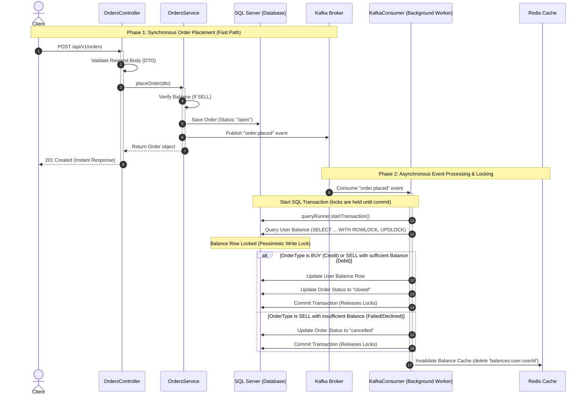

# KoinBX Trading Backend

A production-grade, Clean Architecture trading backend system built with NestJS, TypeScript, TypeORM, MSSQL, Redis, and Confluent Kafka. It is engineered to process orders asynchronously with strict transactional integrity and high-performance caching.

---

## 🏛 Architectural Overview & Core Flow

This backend uses a decoupled, event-driven architecture designed to minimize API response times by handling heavy balance operations asynchronously.

### Sequence diagram of the Order Placement and Processing Flow



---

## 🔒 Database Transactions & Pessimistic Row Locking

To prevent race conditions, double-spending, and balance corruption when processing multiple orders concurrently, the backend enforces strict transaction boundaries and locking mechanisms:

1. **Transaction Encapsulation**: 
   Inside [kafka.consumer.ts](file:///c:/koinbx/src/lib/kafka/kafka.consumer.ts), the message processing uses TypeORM's `QueryRunner` to manually manage the database connection and transaction state:
   - `queryRunner.startTransaction()` starts the database transaction context.
   - If processing is successful, `queryRunner.commitTransaction()` commits all changes.
   - If an error occurs, `queryRunner.rollbackTransaction()` reverts all database writes to keep states clean.
   - `queryRunner.release()` releases the connection back to the database pool in the `finally` block.

2. **Pessimistic Write Locking (`pessimistic_write`)**:
   When reading a user's balance row to credit/debit money, TypeORM issues a `SELECT ... WITH (UPDLOCK, ROWLOCK)` SQL query:
   ```typescript
   const existing = await queryRunner.manager.findOne(Balance, {
     where: { userId: event.userId, currencySymbol: event.currencySymbol },
     lock: { mode: 'pessimistic_write' },
   });
   ```
   This prevents any other database query or transaction from reading/updating this specific balance row until the current transaction commits or rolls back, guaranteeing strict serialization of balance changes.

---

## 🐳 Docker Containers for Development

For local development and testing, a Docker Compose setup is used to launch the required stateful components:

* **SQL Server (MSSQL)** (`port: 1433`): Persists tables for `users`, `orders`, and `balances`.
* **Redis** (`port: 6379`): Acts as a high-speed caching layer.
* **Kafka + Zookeeper** (`port: 9092`): Streams order events. Zookeeper tracks Kafka broker metadata and leader elections.

---

## 📁 Project Directory Structure

Below is the verified structure of the project directory showing where every core architecture file is located:

```text
src/
├── config/                     # Centralized environment configurations
│    ├── database.config.ts     # Database credentials & TypeORM config mapping
│    ├── env.validation.ts      # Joi/class-validator environment config schema
│    └── kafka.config.ts        # Kafka brokers & client credentials mapping
│
├── core/                       # Shared domain layers (framework agnostic)
│    ├── constants/
│    │    └── kafka.constants.ts # Kafka topics definition
│    ├── enums/
│    │    └── order.enum.ts      # EOrderType, EOrderStatus, ECurrencySymbol
│    ├── exceptions/
│    │    ├── exceptions.ts      # Custom domain exceptions (BaseCustomException, DuplicateUserException, etc.)
│    │    └── http-exception.filter.ts # Global HttpException & database error catch filter
│    ├── interfaces/
│    │    ├── balance.interface.ts
│    │    ├── order.interface.ts
│    │    └── user.interface.ts
│    └── types/
│         └── kafka-payload.type.ts # TKafkaOrderPayload type definition
│
├── lib/                        # Infrastructure integration layer
│    ├── database/
│    │    └── database.module.ts # TypeORM module loader
│    ├── kafka/
│    │    ├── kafka.consumer.ts  # Asynchronous background message subscriber
│    │    ├── kafka.module.ts    # Module configuration exporting KafkaProducer
│    │    └── kafka.producer.ts  # Synchronous event publisher client
│    ├── logger/
│    │    └── app-logger.service.ts # AppLogger console writer wrapping LoggerService
│    └── redis/
│         ├── redis.module.ts    # Redis initialization loader
│         └── redis.service.ts   # Generic caching provider (get, set, delete, flushAll)
│
├── modules/                    # Isolated feature domains
│    ├── balances/
│    │    ├── entities/
│    │    │    └── balance.entity.ts # Balance TypeORM Entity definition
│    │    ├── balance.repository.ts  # Direct DB data-access layer wrapping Balance Entity
│    │    ├── balances.controller.ts # Balance endpoints (/balances)
│    │    ├── balances.module.ts
│    │    └── balances.service.ts    # Cache/repository orchestration
│    │
│    ├── orders/
│    │    ├── dto/
│    │    │    └── create-order.dto.ts # CreateOrderDto with class-validator decorators
│    │    ├── entities/
│    │    │    └── order.entity.ts   # Order TypeORM Entity definition
│    │    ├── order.repository.ts    # Direct DB data-access layer wrapping Order Entity
│    │    ├── orders.controller.ts   # Order endpoints (/orders)
│    │    ├── orders.module.ts
│    │    └── orders.service.ts      # Business validation, DB insertion, Kafka publish
│    │
│    └── users/
│         ├── dto/
│         │    └── create-user.dto.ts # CreateUserDto with class-validator decorators
│         ├── entities/
│         │    └── user.entity.ts    # User TypeORM Entity definition
│         ├── user.repository.ts     # Direct DB data-access layer wrapping User Entity
│         ├── users.controller.ts    # User endpoints (/users)
│         ├── users.module.ts
│         └── users.service.ts       # Caching, check duplication, DB write
│
├── scripts/                    # CLI runner files
│    ├── drop-db.ts             # Drops all SQL tables & clears Redis cache
│    └── seed.ts                # Seeds user & balances after flushing cache
│
├── app.module.ts               # Application parent module
└── main.ts                     # Application entry point, global pipes & filter loader
```

---

## 🚀 Setup & Installation

### 1. Start Infrastructure
Launch all backing services using Docker Compose:
```bash
docker-compose up -d
```
*Note: Wait about 20-30 seconds for MSSQL, Redis, and Kafka to finish booting before launching the backend.*

### 2. Install Dependencies
```bash
npm install
```

### 3. Run the Backend
Start the NestJS application in development watch mode:
```bash
npm run start:dev
```
*TypeORM will automatically synchronize the database schema and build the database tables.*

---

## 📡 API Testing & Verification Guide (Step-by-Step)

Follow this end-to-end verification checklist to test order validation, caching, asynchronous message processing, and transaction rollbacks:

### Step 1: Reset Database & Cache
To start from a completely clean state:
```bash
npm run db:drop
```
*This command drops all SQL tables/constraints and flushes all Redis cache keys.*

### Step 2: Seed Test Data
Populate the database with a test user and initial balances:
```bash
npm run db:seed
```
**Output Example:**
```
[2026-05-20T00:00:00.000Z] [LOG] [SeedScript] 🧹 Flushing Redis cache before seeding...
[2026-05-20T00:00:00.000Z] [LOG] [SeedScript] ✅ User seeded: 49584599-e89d-45ef-b33b-55f86bdafc9f
[2026-05-20T00:00:00.000Z] [LOG] [SeedScript] ✅ Balance seeded: 10.50000000 BTC
[2026-05-20T00:00:00.000Z] [LOG] [SeedScript] ✅ Balance seeded: 50.00000000 ETH
[2026-05-20T00:00:00.000Z] [LOG] [SeedScript] ✅ Balance seeded: 100000.00000000 USDT

=========================================
USE THIS USER ID FOR TESTING: 49584599-e89d-45ef-b33b-55f86bdafc9f
=========================================
```
*Keep this printed user ID handy.*

### Step 3: Fetch Initial Balances (Cache Miss -> Write)
Query the user's balances. This will read from the database and write to Redis:
* **Method**: `GET`
* **URL**: `http://localhost:3000/api/v1/balances/user/<USER_ID>`
* **Response**:
  ```json
  [
    { "id": "...", "userId": "<USER_ID>", "currencySymbol": "BTC", "balance": "10.50000000" },
    { "id": "...", "userId": "<USER_ID>", "currencySymbol": "ETH", "balance": "50.00000000" },
    { "id": "...", "userId": "<USER_ID>", "currencySymbol": "USDT", "balance": "100000.00000000" }
  ]
  ```

### Step 4: Submit a Sell Order (Validation & Event Generation)
Place an order to sell `1.5 BTC`:
* **Method**: `POST`
* **URL**: `http://localhost:3000/api/v1/orders`
* **Headers**: `Content-Type: application/json`
* **Body**:
  ```json
  {
    "userId": "<USER_ID>",
    "orderType": "sell",
    "currencySymbol": "BTC",
    "price": 65000.50,
    "quantity": 1.5
  }
  ```
* **Response**: Returns the placed order object (status `"open"`).

### Step 5: Verify Asynchronous Balance Deductions
Wait a split second for the Kafka Consumer background worker to process the order. Then, query the balances again:
* **Method**: `GET`
* **URL**: `http://localhost:3000/api/v1/balances/user/<USER_ID>`
* **Response**: The `BTC` balance will now read `9.00000000` (decreased by `1.5 BTC`).

### Step 6: View Placed Orders
Verify that the order has transitioned to status `"closed"` inside the user's history:
* **Method**: `GET`
* **URL**: `http://localhost:3000/api/v1/orders/user/<USER_ID>`

---

## 🛡️ Error Propagation & Handling Flow

We enforce a clean error flow to isolate database layers from the HTTP controllers and keep business logic simple:

1. **Repository Layer**:
   All database operations inside Custom Repository classes are wrapped in local `try-catch` blocks. Database driver or TypeORM query errors are caught, logged with stack traces internally using `AppLogger`, and translated into a generic `DatabaseException`.
2. **Service Layer**:
   No database `try-catch` blocks. Business exceptions (like `InsufficientBalanceException`) are thrown directly and propagate upwards naturally.
3. **Global Filter (`AllExceptionsFilter`)**:
   Catches custom HTTP exceptions, validation errors, and database exceptions. It formats and returns client-safe JSON responses (preventing internal SQL or server credentials from being exposed):
   ```json
   {
     "statusCode": 500,
     "timestamp": "2026-05-20T00:00:00.000Z",
     "path": "/api/v1/orders",
     "message": "Database write failure"
   }
   ```
